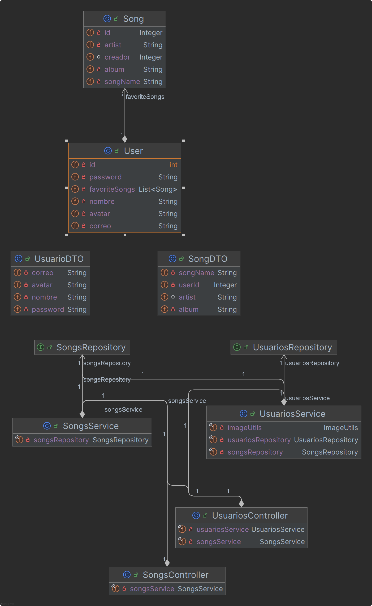
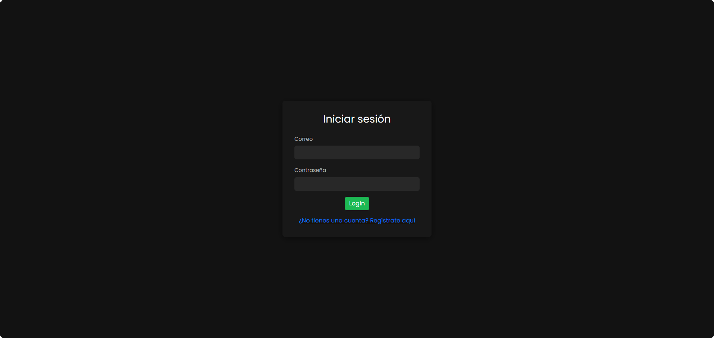
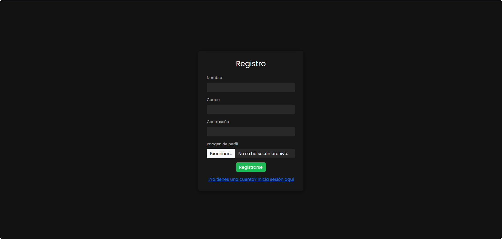
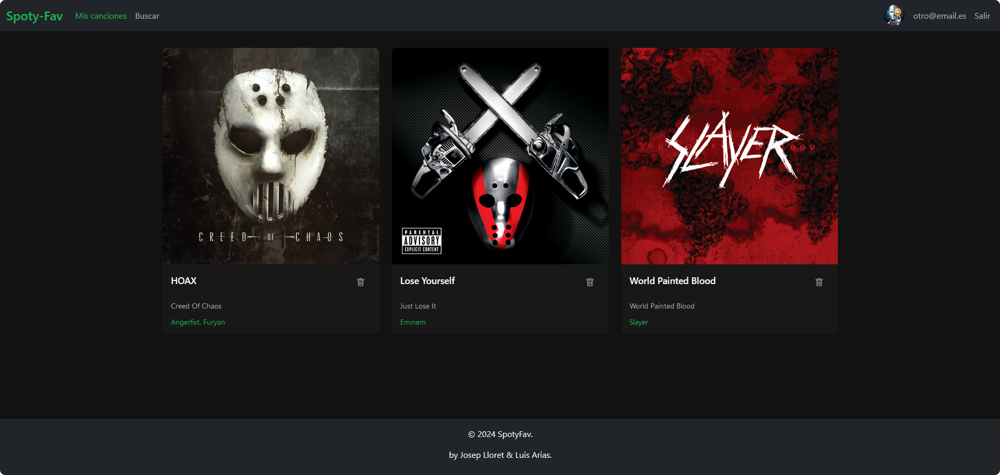
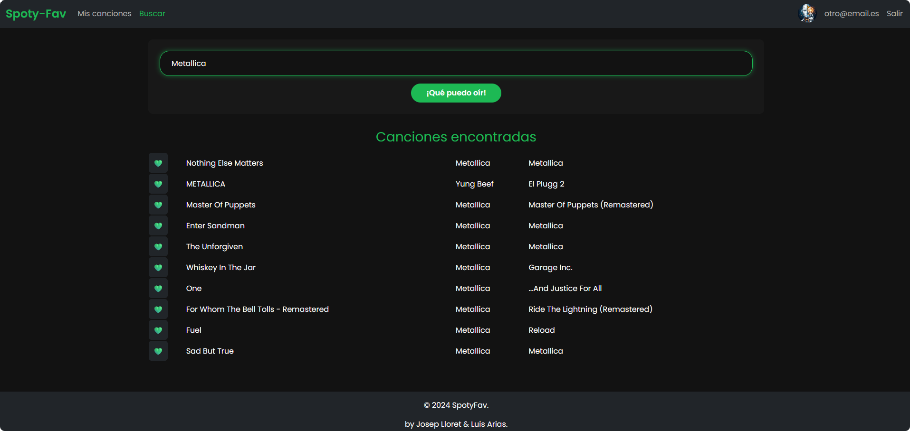
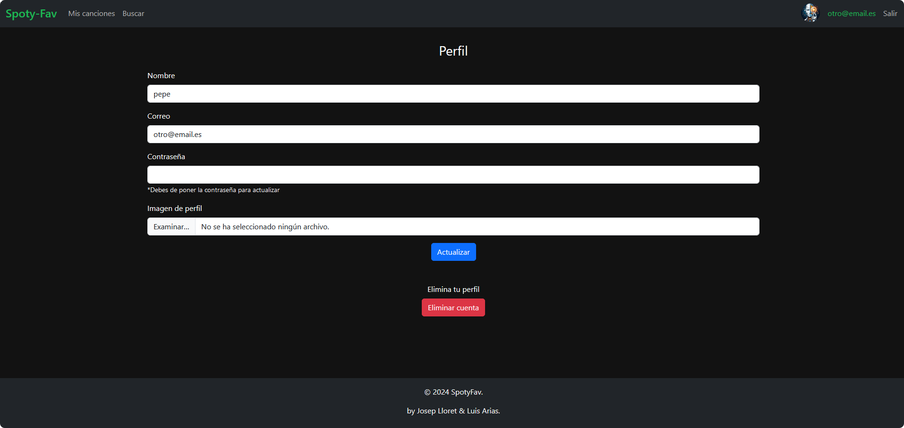

 
 
 
 

  

 
 
 
 
 
 
 
 

  <h1>SpotyFav</h1>
  <h2>Josep Lloret Díaz - Luis Arias</h2>

 
 
 
 
 

  

 
 
 
 
 

## Índice

- **[1. Introducción.](#1-introducción)**
- **[2. Descripción del proyecto.](#2-descripción-del-proyecto)**
- **[3. Tecnologías utilizadas.](#3-tecnologías-utilizadas)**
- **[4. Estructura del código.](#4-estrucutra-del-código)**
- **[5. Funcionamiento del sistema.](#5-funcionamiento-del-sistema)**
- **[6. Capturas de pantalla.](#6-capturas-de-pantalla)**
- **[7. Consideraciones adicionales.](#7-consideraciones-adicionales)**
- **[8. Conclusión.](#8-conclusión-)**

 
 
 
 
 
 
 
 
 
 
 
 
 
 
 
 
 
 
 
 
 
 
 
 
 
 
 
 
 
 
 
 
 
 
 

## 1. Introducción

El objetivo de **SpotyFav** es el de poder guardar **nuestras canciones favoritas**.
El usuario hace una búsqueda desde la web, el cual hace una petición a Spotify y muestra los 10 primeros resultados. Cuando el usuario agrega una de las canciones se obtienen los datos de la canción (nombre, artista y álbum) y se guardan en la Base de Datos. 

## 2. Descripción del proyecto.

Este proyecto denominado **SpotyFav** se compone de 3 partes distintas. Por una parte el Backend, el cual consta de una aplicación en Java usando Spring Boot. Esta aplicación se encarga de enviar la información al Frontend y gestionar los datos de la Base de Datos. La base de datos esta diseñada en MySQL, el cual 2 tablas (Usuario y Canciones Favoritas) tienen relación entre ellas. De forma que un Usuario puede tener canciones y una canción pertenece a un usuario. La tabla usuarios se compone de Id, Nombre, Contraseña y Email. Por otra parte la tabla Canciones favoritas se compone de Id, Id de Usuario, Nombre Canción, Álbum Canción y Artista. Por último tenemos el Frontend siendo un programa web desarrollado en TypeScript, HTML y CSS, el cual el usuario puede hacer CRUD (Create, Read, Update y Delete) del mismo, además de realizar operaciones CRD (Create, Read y Delete) de las canciones pertenecientes a cada usuarios de forma gráfica e intuitiva. El Frontend se compone de login, registro, buscador de canciones, perfil de usuario.

## 3. Tecnologías utilizadas.

- **Java**: Para el desarrollo de backend, el cual se encarga de facilitar los datos del usuario al frontend, además de gestionar la base de datos.
- **MYSQL**: Base de datos relacional, la cual se encarga de almacenar los datos de los usuarios y las canciones favoritas.
- **TypeScript, HTML y CSS**: Para el desarrollo del frontend, el cual se encarga de mostrar los datos de forma gráfica e intuitiva además de hacer la conexión a la API de Spotify para obtener los datos de las canciones.

## 4. Estrucutra del código.

### 📂 `src/main/java/com/eoi/spotyfav/`
Contiene el código fuente principal de la aplicación.

### 📂 `auth/`
- Clases relacionadas con la autenticación.

### 📂 `dto/`
- **Objetos de transferencia de datos (DTO)**:
  - DTO para la autenticación.
  - DTO para las canciones.
  - DTO para los usuarios.

### 📂 `songs/`
- Clases relacionadas con la gestión de canciones.
  - **`Song.java`**: Entidad JPA que representa una canción en la base de datos.
  - **`SongsRepository.java`**: Repositorio JPA para realizar operaciones CRUD sobre la entidad `Song`.
  - **`SongsService.java`**: Servicio que contiene la lógica de negocio para las operaciones de canciones.

### 📂 `usuarios/`
- Clases relacionadas con la gestión de usuarios.
  - **`User.java`**: Entidad JPA que representa a un usuario en la base de datos.
  - **`UsuariosController.java`**: Controlador REST para gestionar las operaciones relacionadas con los usuarios.
  - **`UsuariosRepository.java`**: Repositorio JPA para realizar operaciones CRUD sobre la entidad `User`.
  - **`UsuariosService.java`**: Servicio que contiene la lógica de negocio para las operaciones de usuarios.

### 📄 `SpotyfavApplication.java`
Clase principal de la aplicación que contiene el método `main` para iniciar la aplicación Spring Boot.

---

## 📂 `src/main/resources/`
Contiene recursos estáticos y archivos de configuración.

### 📄 `application.properties`
Archivo de configuración de la aplicación donde se definen propiedades específicas como:
- Configuración de la base de datos.
- Puerto del servidor.
- Otros parámetros de la aplicación.

> :bulb: A continuación se muestra el diagrama de clases de la aplicación.

## 5. Funcionamiento del Sistema.

1. Si el usuario no tiene la sesión iniciada, se le mostrará la pantalla de login, donde podrá iniciar sesión o registrarse.
2. En el caso de que el usuario no tenga cuenta, podrá registrarse en la aplicación.
3. Una vez iniciada la sesión, se verán las canciones favoritas del usuario, si es la primera vez que inicia esta estará vacía.
4. La pestaña "Buscar" permite al usuario buscar canciones en Spotify y agregarlas a sus favoritos.
5. Una vez añadida la canción la página será redirigida a la pestaña de "Favoritos" donde se mostrarán las canciones añadidas.
6. Para mostrar el perfil del usuario se puede hacer clic en el correo de usuario en la parte superior derecha.
7. En el perfil del usuario se puede ver el correo, cambiar la contraseña y eliminar su perfil.
8. Para cerrar sesión se puede hacer clic en el botón de cerrar sesión en la parte superior derecha en cualquier parte del la aplicación.

>:bulb: Para actualizar el usuario es indispensable poner la contraseña, de forma que si escriba una nueva esta cambiará, pero si escribe la misma esta se mantendrá.

## 6. Capturas de pantalla.

## 7. Consideraciones adicionales.

## Áreas de mejora 🌟
- **Pruebas Unitarias y de Integración**:  
  La implementación de pruebas automatizadas fortalecería la calidad del código y reduciría riesgos al agregar nuevas funcionalidades. ✅

- **Autenticación y Seguridad**:  
  A medida que el proyecto crezca, sería ideal reforzar las clases de autenticación y añadir soporte para estándares como **OAuth 2.0**.

- **Documentación API**:  
  Incorporar herramientas como Swagger facilitaría a los desarrolladores externos interactuar con la API y entender su uso.            

  
 

## 8. Conclusión 🎵.

El proyecto **SpotyFav** es una aplicación robusta y bien estructurada desarrollada con **Spring Boot** para la gestión de canciones favoritas por parte de los usuarios. La arquitectura del proyecto refleja buenas prácticas de desarrollo, destacando una clara separación de responsabilidades y modularidad en su diseño. 💪

### Puntos clave del proyecto 💡

1. **Estructura Modular y Clara**:  
   La organización del código en paquetes específicos (`auth`, `songs`, `usuarios`) asegura que cada funcionalidad esté bien encapsulada, facilitando el mantenimiento y escalabilidad de la aplicación.

2. **Uso de Spring Boot y JPA**:  
   La integración con Spring Boot proporciona una base sólida para la aplicación, mientras que el uso de JPA permite interactuar eficientemente con la base de datos, asegurando operaciones CRUD robustas para entidades clave como `Song` y `User`.

3. **Modelo de Datos Sencillo y Eficiente**:  
   Aunque las canciones no se almacenan directamente en la base de datos, el uso de una tabla intermedia (`CancionesFavoritas`) para relacionar usuarios y canciones demuestra un diseño eficiente para manejar datos dinámicos consultados a través de la API de Spotify.

4. **Interfaz RESTful**:  
   La inclusión de un **controlador REST** para las operaciones relacionadas con los usuarios garantiza una comunicación fluida con el cliente, sentando las bases para una experiencia de usuario sólida.

5. **Configuración Centralizada**:  
   El archivo `application.properties` facilita la configuración de parámetros esenciales como la base de datos y el puerto del servidor, promoviendo un desarrollo y despliegue ágiles.

## Impacto y Futuro 🛡️
**SpotyFav** es una aplicación con gran potencial para convertirse en una plataforma dinámica que aprovecha la API de Spotify para ofrecer valor añadido a sus usuarios. Gracias a su diseño modular y al uso de tecnologías modernas, está bien posicionada para escalar en funcionalidad y alcance.

¡Este proyecto es un ejemplo claro de fuerza y calidad en el desarrollo! 🦾🔥

